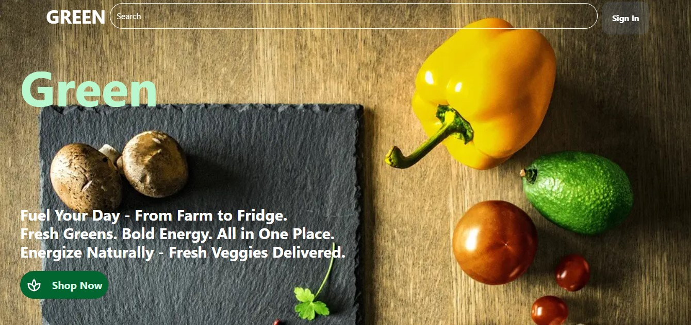

# 🔥 Project
- A Full-Stack Ecommerce website. That can handle all of the ecomm user features. Featuring seamless payment processing through Stripe, you have the capability to purchase order from you shopping cart.

# 🔗 Live Demo


👉 [View](https://green-ecom-website.vercel.app/)

# 🛠️ Tech Stack
- Next JS
- TypeScript
- React JS
- Auth JS
- Tailwind CSS
- Prisma
- Postgres SQL
- Zod
- Zustand
- Stripe
- Motion
- React Hot Toast

# 👨‍💻 Code Overview
- A Full-stack web app created using Next JS
- Build using a high profisional components
- State management using zustand
- Next Auth Setup

# 💎 Features
- Full User Authentication System
    - Sign UP
    - Sign IN
    - Forget Password 👉 Using user Email to send a reset password link
    - Reset password 👉 Using a reset link that is valid to use for only one time
    - Login with Google
- Modern Design & Animations
- E-Commerce
    - Cart (add product , remove product, clear cart)
    - Checkout using Stripe webhooks
- Search 👉 You can search to find any product you want using the search bar in the header.
- Category Page 👉 Contains all of the products which are under the same category.

# 📂 Pages
- Signup / signin / forget password / reset password pages.
- Home Page 👉 Modern, Clean, Cool, and Amazing Design. Contains 5 Sections
    - Hero
    - Categories
    - Products
    - Features
    - Newsletter
- Category Page 👉 Contains all of the products which are under the same category.
- Product Page 👉 Contains all products details. It's where you can add the product to the cart.
- Cart 👉 It's where you can manage your shopping cart and checkout your order.
- Checkout Page 👉 Generated by stripe webhooks.

# ⚡ Quick Start

1. Clone the project

```bash
git clone https://github.com/MO-GBR/green_ecom_website.git

cd green_ecom_website

npm install
```

2. Create a .env file
```bash
DATABASE_URL="⚠ Your prisma connection string"
AUTH_SECRET=
AUTH_GOOGLE_ID=
AUTH_GOOGLE_SECRET=
EMAIL_SERVICE=
EMAIL_USERNAME=
EMAIL_PASSWORD=
EMAIL_FROM=
CLIENT_URL="http://localhost:3000"
NEXT_PUBLIC_STRIPE_PUBLIC_KEY=
STRIPE_SECRET_KEY=
STRIPE_WEBHOOK_SECRET=
```

3. Create prisma client
- Run this command
```bash
npx prisma generate
```

4. Run the dev command and open: http://localhost:3000/
- The Dev Command
```bash
npm run dev
```